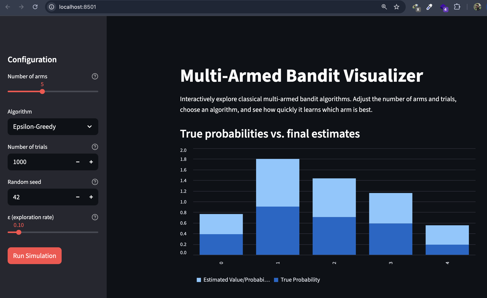
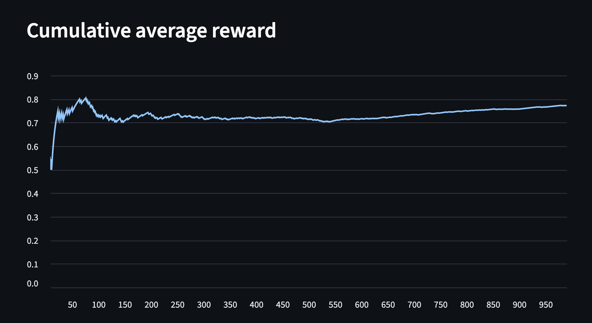
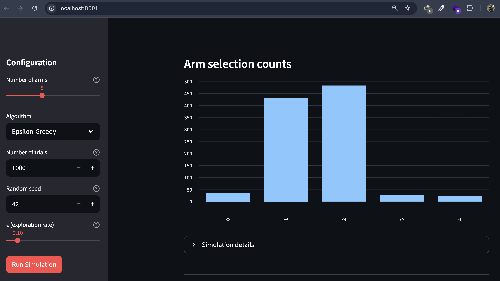

Here is a **clean, modern, styled, professional-looking README section** based on your content — still human-written, still simple, but visually structured and portfolio-friendly.

You can paste this directly into your README.

---

# Multi-Armed Bandit Visualizer

This project is an interactive web-based tool for exploring classical multi-armed bandit algorithms. It demonstrates how different strategies handle the exploration–exploitation trade-off and how they learn the optimal action over repeated trials.

The application is built with **Python** and **Streamlit**, and provides:

* Adjustable number of arms
* Multiple algorithms (Epsilon-Greedy, UCB1, Thompson Sampling)
* Customizable trial count and random seed
* Real-time visualizations showing learning dynamics

These features make it a practical educational tool for understanding foundational reinforcement learning concepts.

---

## Visual Results

The following figures illustrate how the agent interacts with the environment and how its estimates evolve throughout the simulation.

---

### True Probabilities vs Estimated Values

This visualization compares the hidden true reward probabilities of each arm with the algorithm’s learned estimates after training. It highlights how effectively the agent identifies the best option.

---

### Cumulative Average Reward

This plot shows the cumulative average reward over time. It reflects how quickly and consistently the chosen algorithm converges toward optimal behavior.

---

### Arm Selection Counts

This bar chart displays how often each arm was selected during the simulation, offering insight into exploration patterns and the algorithm’s confidence in its estimates.

---

